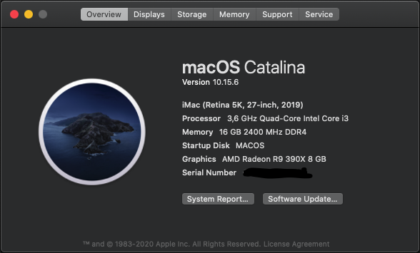

# Hackintosh Catalina 10.15.6 for Asrock B365 Pro4 

# AsrockB365-Pro4-OpenCore
This is a bootloader for hackintosh using OpenCore for Asrock B365 Pro4.
For Audio layout, I'm using layout-18. (if you have same motherboard, don't worry about it)

# Tested on Catalina 10.15.6
List of supported GPU can be found in here : 
[AMD GPU Buyers Guide!](https://dortania.github.io/GPU-Buyers-Guide/modern-gpus/amd-gpu.html#native-amd-gpus)

# This is my spec :
- Motherboard   : Asrock B365 Pro4
- CPU           : i3 - 9100
- RAM           : Hynix 2x8GB DDR4 2400MHz
- Dedicated GPU : Gigabyte R9 390x
- Integrated GPU: Intel UHD 630
- SSD           : 512GB - TOSHIBA THNSNJ512GCSU
- WiFi          : BCM943224PCIEBT2 with M.2 adapter (This one still on shipping, hopefully it will work because it is used by Macbook Air)

# What's not Working ?
- Sleep Mode : If you are only use Integrated GPU (Intel UHD 630), Sleep is not working.
    But you can put screensaver, to prevent the PC from sleeping.
    If you are using Dedicated GPU that supported natively by macOS, Sleep is working.
- Location : Couldn't find current location

# What's working ?
- So far everythings are okay except those 2 things.

# Screenshot
About My Mac

# Recommended Tutorial for Generating Your Own OpenCore
Visit this video for the magic tutorial
[Install macOS on any PC!](https://youtu.be/eUnVzJsINCI)